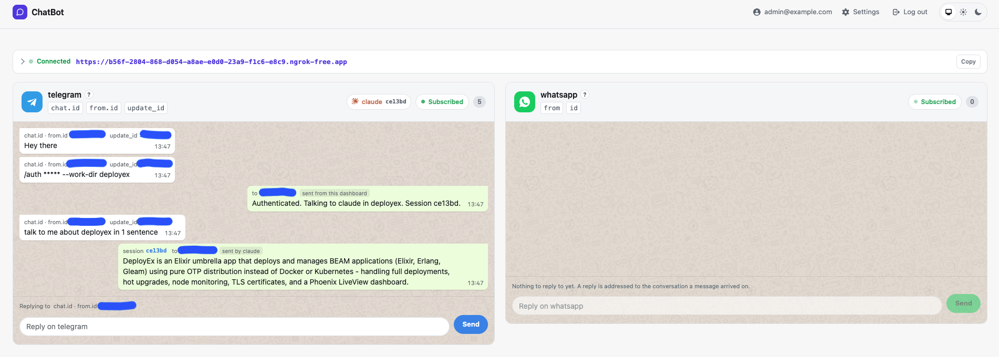

# ChatAgent

A Phoenix application that receives chat messages from WhatsApp and Telegram, shows them on a dashboard, and can hand a conversation to an assistant that answers it.

Three pieces make that work, and each one is optional:

- **Channels** receive messages over webhooks and send replies back.
- **A tunnel** gives the app a public URL on a development machine, so those webhooks have somewhere to arrive, and tells each service where that is.
- **An assistant** answers an authenticated conversation by running the `claude` command line tool.



The strip across the top is the public URL the chat services call.
Each card is one channel, and the badge beside a channel's name is the session answering it: which assistant, and which session.

> **This is not ready for production.**
> See [Running it anywhere else](#running-it-anywhere-else) for what would have to change first.
> Everything below assumes a development machine.

## Requirements

The toolchain is pinned in `.tool-versions`, currently Erlang 28.5.0.4 and Elixir 1.19.5-otp-28.

| For | You need |
|---|---|
| Everything | Elixir and Erlang as pinned above |
| A public URL | either the [`ngrok`](https://ngrok.com/download) agent, or `ssh` for [Pinggy](https://pinggy.io) |
| Receiving messages | a Telegram bot token from [@BotFather](https://t.me/botfather) |
| Answering messages | the [`claude`](https://claude.com/claude-code) command line tool, signed in |

## Getting started

```bash
mix setup          # dependencies, database, assets
mix phx.server     # http://localhost:4000
```

`mix setup` creates a SQLite database at `priv/repo/dev.sqlite3` and seeds the accounts named in configuration, which by default is none.
Give yourself one in the next step.

### Local configuration

Everything specific to your machine, including every secret, goes in `config/dev.override.exs`.
That file is gitignored and is the only place credentials belong.

```elixir
import Config

# The account you sign in to the dashboard with. Seeded by `mix setup`, or by
# `mix run priv/repo/seeds.exs` once you have added it here.
config :chat_agent, :repo_seeds,
  default_user: %{email: "you@example.com", password: "a-long-random-password"}

# The Telegram bot you are running, from @BotFather. The allow list decides
# which conversations it answers at all: empty means anyone who finds the bot,
# a list means those and no others, in both directions.
config :chat_agent, ChatAgent.Channel.Telegram,
  bot_token: "1234567890:AAFAKEfakeFAKEfakeFAKEfakeFAKEfake0",
  allowed_chat_ids: ["123456789"]

# A public URL, so Telegram has somewhere to deliver to. Pick one provider.
config :chat_agent, ChatAgent.Tunnel, provider: ChatAgent.Tunnel.Provider.Ngrok

config :chat_agent, ChatAgent.Tunnel.Provider.Ngrok,
  authtoken: "2FAKEfakeFAKEfakeFAKEfakeFAKEfake_3fakeFAKEfakeFAKEfake"

# Or, instead of ngrok, an SSH tunnel that needs no binary to install:
#
#     config :chat_agent, ChatAgent.Tunnel, provider: ChatAgent.Tunnel.Provider.Pinggy
#
#     config :chat_agent, ChatAgent.Tunnel.Provider.Pinggy,
#       access_token: "fake-pinggy-token"

# Who may talk to the assistant, and where it may work. This is a hash of the
# password, not the password, so the file never holds one. Generate it with:
#
#     mix run -e 'IO.puts(Pbkdf2.hash_pwd_salt("the password you will type"))'
#
# Without one nobody is let in and the assistant is not started at all.
config :chat_agent, ChatAgent.Assistant,
  salted_password: "$pbkdf2-sha512$160000$FAKEfakeFAKEfakeFAKEfake$FAKEfakeFAKEfake",
  working_dir_root: "/Users/you/code"

# What the assistant may do. Nothing is granted by default.
config :chat_agent, ChatAgent.Assistant.Claude,
  settings: "/Users/you/code/chat_agent/claude.settings.local.json",
  permission_mode: "acceptEdits",
  disallowed_tools: ["Bash(rm:*)"]
```

Then seed the account and start the server:

```bash
mix run priv/repo/seeds.exs
mix phx.server
```

Sign in at [`/users/log-in`](http://localhost:4000/users/log-in) with the email and password you seeded.
The dashboard is at [`/channels`](http://localhost:4000/channels).

Registration exists at `/users/register`, but it sends a magic link by email and development has no mailbox to read it in, so seed the account instead.

## A public URL

A chat service delivers messages by calling a URL, which a development machine does not have.
Configure a provider and the app opens a tunnel at startup, then tells each channel where its webhook now lives.

The strip at the top of the dashboard shows the URL, the state of the tunnel, and what each channel was told:

```
▸ ● Connected   https://4c5b-….ngrok-free.app                     [Copy]
```

| Provider | Set up | Notes |
|---|---|---|
| ngrok | install the agent, then `ngrok config add-authtoken …` or set `authtoken` | A free URL changes on every restart |
| Pinggy | nothing to install beyond `ssh` | A free tunnel expires after an hour, and the app opens another; a token keeps one URL |

Either way, `TUNNEL_PROVIDER=ngrok mix phx.server` works as well as configuring the provider in the override file.

## Answering a conversation

With `ChatAgent.Assistant`'s password set, a conversation can ask for an answer.
It starts closed, and these are the only words it understands:

```
/auth <password>                      open a session on the default assistant
/auth <password> --work-dir my-repo   say which checkout it works in
/auth-<name> <password>               name the assistant
/stop                                 close the session
```

A session closes itself after five minutes of silence, and says so.
`--work-dir` names one directory under `working_dir_root`, and nothing outside it.

**What the assistant may do is entirely up to you, and nothing is granted by default.**
Permissions live in the settings file named by `ChatAgent.Assistant.Claude`'s `settings` key:

```json
{
  "permissions": {
    "allow": ["Read", "Grep", "Bash(git status *)", "Bash(git diff *)"],
    "deny":  ["Bash(rm *)", "Bash(gh auth *)", "Read(**/.env)"]
  }
}
```

`priv/claude/settings.example.json` is a worked example for a bot that opens branches and pull requests.
Grant the narrowest thing that does the job: whatever you grant is granted to **every** conversation that knows the password, and the tool acts as whoever is running this application.

## Everyday commands

```bash
mix phx.server                 # run it
iex -S mix phx.server          # run it with a shell

mix test                       # the suite
mix test --cover               # with coverage, which is a gate rather than a number
mix precommit                  # what to run before pushing: compile, format, test, credo

mix ecto.reset                 # start the database over
mix run priv/repo/seeds.exs    # seed the accounts named in configuration
```

`AGENTS.md` is the guide to how the code is organised and why, including what was measured about the tools this app drives rather than assumed.

## Running it anywhere else

**This is not ready for production**, and the reasons are worth reading before deciding to try:

- **The assistant runs a command line tool as whoever runs this application.** Anyone who knows the chat password gets whatever permissions you granted it. That is the feature, and it is also the whole security boundary.
- **Registration is open and no mailer is configured.** Anyone who can reach `/users/register` can create an account, and magic links cannot be delivered, so logging in depends on seeded accounts.
- **The database is a single SQLite file** with one writer. Fine for one machine, and not a story for more than one.
- **Nothing rate limits an inbound webhook**, and a chat service will happily retry.

If you run it anyway, the parts that already work like a deployment are:

```bash
PHX_HOST=chat.example.com          # the public URL, instead of a tunnel
SECRET_KEY_BASE=…                  # mix phx.gen.secret
DATABASE_PATH=/data/chat_agent.db  # a mounted volume
ASSISTANT_SALTED_PASSWORD=…        # a hash, not a password; without one nothing is answered
```

A release cannot run Mix, so migrations run through the release itself:

```bash
bin/chat_agent eval "ChatAgent.Release.migrate()"
```

Run that before starting the application rather than from inside it: a node that migrates on boot races every other node doing the same.
